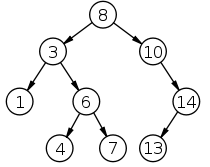
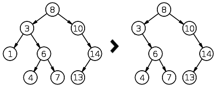
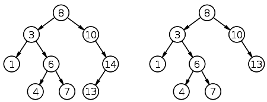
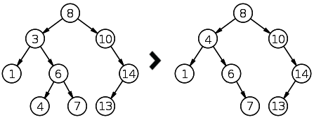

二叉树
=======

二叉树的性质：

    * 若任意节点的左子树不空，则左子树上所有结点的值均小于它的根结点的值；
    * 任意节点的右子树不空，则右子树上所有结点的值均大于它的根结点的值；
    * 任意节点的左、右子树也分别为二叉树。
    * 没有键值相等的节点（no duplicate nodes）。

二叉查找树相比于其他数据结构的优势在于查找、插入的时间复杂度较低。二叉查找树是基础性数据结构，用于构建更为抽象的数据结构，如集合、multiset、关联数组等。

.. code:: python

    class Node:
        """
        二叉树左右枝
        """
        def __init__(self, data):
            """
            节点结构
            """
            self.left = None
            self.right = None
            self.data = data

        def insert(self, data):
            """
            插入节点数据
            """
            if data < self.data:
                if self.left is None:
                    self.left = Node(data)
                else:
                    self.left.insert(data)
            elif data > self.data:
                if self.right is None:
                    self.right = Node(data)
                else:
                    self.right.insert(data)

        def lookup(self, data, parent=None):
            """
            二叉树查找
            """
            if data < self.data:
                if self.left is None:
                    return None, None
                return self.left.lookup(data, self)
            elif data > self.data:
                if self.right is None:
                    return None, None
                return self.right.lookup(data, self)
            else:
                return self, parent

        def children_count(self):
            """
            子节点个数
            """
            cnt = 0
            if self.left:
                cnt += 1
            if self.right:
                cnt += 1
            return cnt

        def delete(self, data):
            """
            删除节点
            """
            node, parent = self.lookup(data)        #已有节点
            if node is not None:
                children_count = node.children_count()      #判断子节点数
                if children_count == 0:
                    # 如果该节点下没有子节点，即可删除
                    if parent.left is node:
                        parent.left = None
                    else:
                        parent.right = None
                    del node
                elif children_count == 1:
                    # 如果有一个子节点，则让子节点上移替换该节点（该节点消失)
                    if node.left:
                        n = node.left
                    else:
                        n = node.right
                    if parent:
                        if parent.left is node:
                            parent.left = n
                        else:
                            parent.right = n
                    del node
                else:
                    # 如果有两个子节点，则要判断节点下所有叶子
                    parent = node
                    successor = node.right
                    while successor.left:
                        parent = successor
                        successor = successor.left
                    node.data = successor.data
                    if parent.left == successor:
                        parent.left = successor.right
                    else:
                        parent.right = successor.right

        def compare_trees(self, node):
            """
            比较两棵树，比较两个二叉树的方法中，只要有一个节点（叶子）与另外一个树的不同，就返回False，也包括缺少对应叶子的情况。
            """
            if node is None:
                return False
            if self.data != node.data:
                return False
            res = True
            if self.left is None:
                if node.left:
                    return False
            else:
                res = self.left.compare_trees(node.left)
            if res is False:
                return False
            if self.right is None:
                if node.right:
                    return False
            else:
                res = self.right.compare_trees(node.right)
            return res

        #前序（pre-order，NLR）
        def preorder(node):
            if node is not None:
                print(node.data)
                preorder(node.left)
                preorder(node.right)

        #中序（in-order，LNR）
        def inorder(node):
            if node is not None:
                inorder(node.left)
                print(node.data)
                inorder(node.right)

        #后序（post-order，LRN）
        def postorder(node):
            if node is not None:
                postorder(node.left)
                postorder(node.right)
                print(node.data)

        #层序（level-order）
        def levelorder(node, more=None):
            if node is not None:
                if more is None:
                    more = []
                more += [node.left, node.right]
                print node.data,
            if more:
                levelorder(more[0], more[1:])

二叉树删除节点示例
-------------------------
得到要删除节点下的子节点数目后，需要进行三种情况的判断

    * 如果没有子节点，直接删除
    * 如果有一个子节点，要将下一个子节点上移到当前节点，即替换之
    * 如果有两个子节点，要对自己点的数据进行判断，并从新安排节点排序

root.delete(1)

root.delete(14)

root.delete(3)

