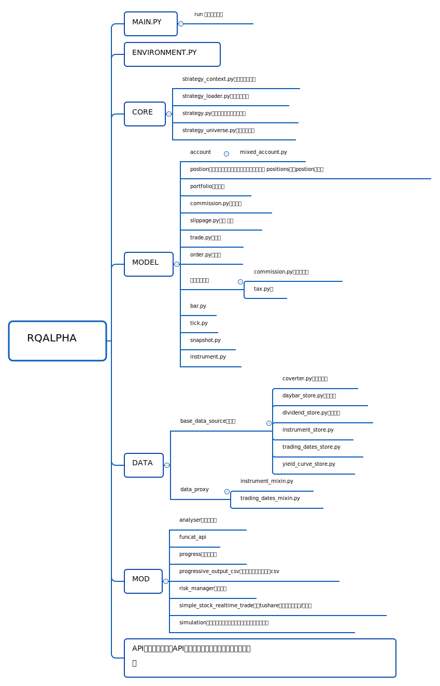
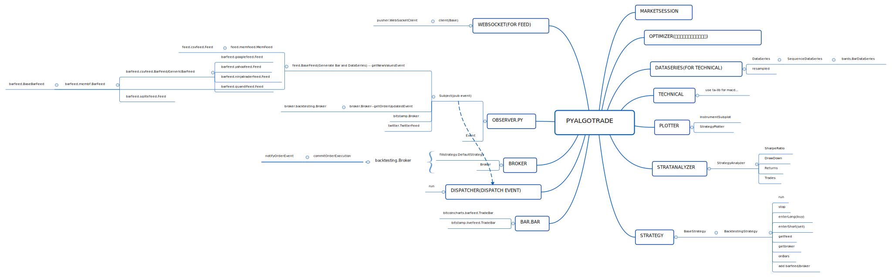

量化回测引擎浅谈
=====================
最近阅读了几个量化回测引擎的源码，对量化回测引擎的原理有了一些理解。

米筐开源的 RQAlpha 引擎工程化非常好，代码整洁，文档全，推荐阅读学习。
PyAlgoTrade 的代码也很易读，两个结合阅读效果不错。

这两个量化引擎都是基于事件的，即引擎基于时间及交易数据产生事件，用户的策略订阅事件，在事件发生时用户注册的函数会被调用，根据行情信息决定买入还是卖出。账户及券商模块比较特殊，他们既是事件的订阅者也是事件的产生者（订阅行情事件用于产生交易，生成交易事件通知用户）。

常见的事件有：

    * on_init
    * on_day_start
    * on_bar
    * on_day_end

当然真实的交易引擎中还有很多其他事件，但最重要的就是这几类事件。

从原理上来讲，量化引擎也是一个决策系统，输入一般是行情数据，用户的策略在引擎内运行，根据行情产生决策，而券商/账户板块则负责决策的执行与统计。

RQAlpha 是单事件源，行情以外的信息需要用户调用api或自己去取。

PyAlgoTrade 为多事件源，所有的输入都可以是事件源，可以有多种不同的事件源，例如根据关键字过滤 twitter 上的内容等。

当然在 RQAlpha 中也可以通过在 AbstractEventSource 的 event 函数（事件生成器）产生多种类型数据的事件，但实现起来略显麻烦。
而且官方实现中的两个例子（ SimulationEventSource/RealtimeEventSource ）也是只有行情数据的事件源。

其他模块的实现类似，在此就不多写了，还是多看代码吧，看代码的过程中画了两个简单的结构图，供参考。

