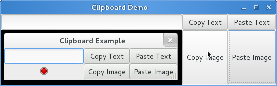

剪贴板
=========

:class:`Gtk.Clipboard` 为各种数据提供了一个存储区域，包括文本和图像。使用剪贴板
允许这些数据在不同的程序间通过复制、剪切、粘贴等动作共享。这些动作通常通过三种
方式完成：使用键盘快捷键、使用 :class:`Gtk.MenuItem` ，将这些动作的函数与
:class:`Gtk.Button` 控件连接。

对于不同的目的有多种的剪贴板，在觉到多数环境下， ``ClIPBOARD`` 用于日常的复制和
粘贴， ``PRIMARY`` 则存储光标选中的文本。

Clipboard 对象
-----------------
.. class:: Gtk.Clipboard

    .. method:: get(selection)

        根据 selection 获得相应的 :class:`Gtk.Clipboard` 。

        *selection* 为描述使用哪一个剪贴板的 :class:`Gdk.Atom` 的实例。
        预定义的值：

        * ``Gdk.SELECTION_CLIPBOARD``
        * ``Gdk.SELECTION_PRIMARY``

    .. method:: set_text(text, length)

        设置剪贴板的内容为给的的文本。

        *text* 是要放进剪贴板的字符串。

        *length* 是要存放的字符数。如果存储整个字符串则可以忽略。

    .. method:: set_image(image)

        设置剪贴板的内容为给定的图像。

        *image* 必须为 :class:`Gdk.Pixbuf` 的实例。
        要从 :class:`Gdk.Image` 获取，使用 ``image.get_pixbuf()`` 。

    .. method:: wait_for_text()

        以字符串返回剪贴板的内容，如果剪贴板为空或者当前没有文本则返回 ``None`` 。

    .. method:: wait_for_image()

        以 :class:`Gtk.Pixbuf` 返回接铁板的内容。
        如果剪贴板内没有图像或为空则返回 ``None`` 。

    .. method:: store()

        在本程序之外保存剪贴板的内容，否则拷贝到剪贴板中的数据可能会在程序退出时会消失。

    .. method:: clear()

        清除剪贴板的内容。
        使用请注意，可能会清除其他程序设置的内容。

Example
-------

.. literalinclude:: examples/clipboard_example.py
    :linenos:

