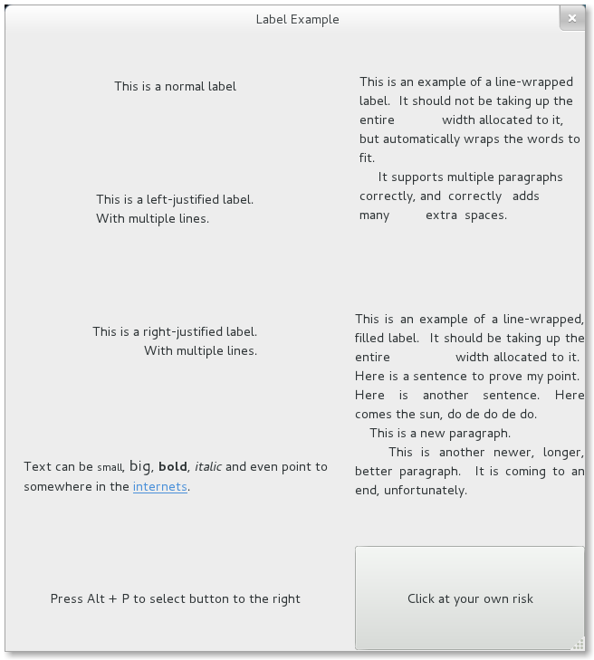

标签Label
===========

标签是在窗口中显示不可编辑文本的主要方法，例如要在 :class:`Gtk.Entry` 控件旁边放置一个标题。
你可以在构造函数中指定文本的内容，也可以在后面调用 :meth:`Gtk.Label.set_text` 或 :meth:`Gtk.Label.set_markup` 方法设置。

标签的宽度会自动调整。你可以把换行符（“\\n”）放在标签内容中来产生一个多行的标签。

标签可以通过 :meth:`Gtk.Label.set_selectable` 设置为可以选择。可选择的标签允许用户拷贝标签的内容到剪贴板。
一般只有包含需要拷贝的内容——如错误信息时才设置标签为可选择的。

标签文本可以通过 :meth:`Gtk.Label.set_justify` 方法来设置对齐方式。当然你可以自动换行——只要调用 :meth:`Gtk.Label.set_line_wrap` 。

:class:`Gtk.Label` 支持一种简单的格式，例如允许你使某些文本显示为粗体、某种颜色或者更大号。
你可以通过使用 :meth:`Gtk.Label.set_markup` 设置标签内容来实现这些效果，
这个函数使用Pango标记语言的语法  [#pango]_ 。例如， ``<b>bold text</b> and <s>strikethrough text</s>`` 。
另外， :class:`Gtk.Label` 也支持可以点开的超链接。超链接的标记借用了HTML的方法，使用带有href和taitle属性的a标记。 
GTK+呈现的超链接与浏览器中很相似——带有颜色和下划线。Title作为该链接的提示信息。

.. code-block:: python

    label.set_markup("Go to <a href=\"http://www.gtk.org\" title=\"Our website\">GTK+ website</a> for more")

标签也可以包含 *助记符(mnemonics)* ，助记符是标签中带有下划线的字符，用户键盘导航（呃，其实就是快捷键啦）。
助记符通过在助记符字符前添加下划线来实现，例如 “_File” ，需要调用 :meth:`Gtk.Label.new_with_mnemonic` 或者
:meth:`Gtk.Label.set_text_with_mnemonic` 。助记符会自动计划包含该标签的控件。例如 :class:`Gtk.Button` ；
如果标签不在助记符的目标控件中，你需要通过 :meth:`Gtk.Label.set_mnemonic_widget` 手动设置。

Label Objects
-------------

.. class:: Gtk.Label([text])

    创建一个内容为 *text* 的标签，如果 *text* 忽略，则会创建一个空标签。

    .. staticmethod:: new_with_mnemonic(text)

    创建了一个新的标签，内容为 *text* 。

　　如果 *text* 里的字符前面加一下划线，那这些字符即被强调。如果你需要一个下划线字符就要用 '__' 。第一个下划线代表键盘快捷键（助记符）。
    助记符的按键可以用来激活另一个窗口控件，这个窗口控件是自动选择的，或者你也可以调用 :meth:`Gtk.Label.set_mnemonic_widget` 来修改。

    如果没有调用 :meth:`Gtk.Label.set_mnemonic_widget` ，则 :class:`Gtk.Label` 标签的第一个可被激活的祖先会被选择作为助记符控件。
    例如，如果标签是在一个按钮活在个一个菜单项里，那么按钮或菜单项就会自动成为助记符控件并且会自动被助记符激活。

    .. method:: set_justify(justification)

    设置标签内的文本行相对于其他行的对齐方式， *justification* 可以设置为
    :attr:`Gtk.Justification.LEFT`,
    :attr:`Gtk.Justification.RIGHT`, :attr:`Gtk.Justification.CENTER`,
    :attr:`Gtk.Justification.FILL` 之一。 对于包含单行文本的标签无效。

    .. method:: set_line_wrap(wrap)

    如果 *wrap* 为 ``True`` ，如果文本超过控件的大小时会自动折行。如果设置为 ``False`` ，若超过控件大小，文本会根据控件的边缘被截断。

    .. method:: set_markup(markup)

    根据Pango标记语言解析 *markup* 标记后的文本设置标签内容。标记必须有效，例如，<, >, &这些字符必须写作&lt; &gt; 和&amp。

    .. method:: set_mnemonic_widget(widget)

    如果标签设置了带有助记符的内容，此方法设置与助记符关联的目标控件。

    .. method:: set_selectable(selectable)

    设置使用允许用户可以选择标签内的文本，用于复制粘贴。

    .. method:: set_text(text)

    设置控件内的文本，会覆盖之前设置的文本。

    .. method:: set_text_with_mnemonic(text)

    参照 :meth:`new_with_mnemonic` 。

Example
-------

.. literalinclude:: examples/label_example.py
    :linenos:

.. [#pango] Pango Markup Syntax, http://developer.gnome.org/pango/stable/PangoMarkupFormat.html
