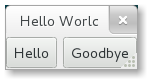

.. _layout:

布局管理
=================
当很多GUI工具包要求你使用绝对位置来精确地摆放窗括部件时，GTK+使用了一个不同的方式。
不需要指定每一个窗口部件的位置和大小，你可以以行、列或者表格来摆放你的窗口部件。
你的窗口的大小可以自动的决定——基于其包含的窗口部件的尺寸。并且，
部件的尺寸是由其包含的文本数或者你指定的最大最小尺寸或者你指定在部件之间共享的空间大小来决定的。
你可以通过指定每一个部件的填充大空间小来设置你自己的布局。当用户操作窗口时GTK+根据这些信息可以很平滑地重新摆放和改变这些部件的大小。

GTK+使用 *容器* 来分层次地管理这些窗口部件。这些容器对于终端用户来是是不可见的，容器一般插入到窗口里，或者放入到其他容器里以布局组件。
有两种类型的容器：单孩子容器—— :class:`Gtk.Bin` 的子孙和多孩子容器—— :class:`Gtk.Container` 的子孙。
最常用的容器是水平和垂直的Box盒子(:class:`Gtk.Box`)，表格(:class:`Gtk.Table`)和网格(:class:`Gtk.Grid`)。

Boxes盒子
---------

Box盒子是不可见的容器，我们可以把我们的窗口控件打包近Box盒子。当将窗口控件打包进水平（horizontal）的盒子时，
这些对象水平地插入到盒子中来，根据使用 :meth:`Gtk.Box.pack_start` 或者 :meth:`Gtk.Box.pack_end` 
可能是从左到右页可能是从右到左。而对于一个垂直的盒子，对象可能是垂直地从上到下或相反方向插入到盒子里来。
你可以使用任何组合方式的盒子（放在其他盒子中或者挨着其他盒子）来创建任何你想要达到的效果。

Box 对象
^^^^^^^^^^^

.. class:: Gtk.Box([homogenous[, spacing]])

    :class:`Gtk.Box` 的矩形区域被组织为或者是单行或者是单列的子窗口部件——这依赖于
    “orientation”属性被设置为 :attr:`Gtk.Orientation.HORIZONTAL` 或者 :attr:`Gtk.Orientation.VERTICAL` 。
    如果 *homogeneous* 属性为 ``True`` ，盒子中所有的部件大小将相同，它们的大小由最大的那个部件决定。如果不设置，默认为 ``False`` 。
    *spacing* 指子窗口部件之间默认的像素值。如果忽略，则不填充空白，即 *spacing* 为0。
    默认子窗口部件被组织为一行，即“orientation”属性为 :attr:`Gtk.Orientation.HORIZONTAL` 。
    :class:`Gtk.Box` 使用了 *打包（packing）* 的概念。打包指将一个窗口部件的一个引用添加到一个 :class:`Gtk.Container` 容器中。
    对于一个 :class:`Gtk.Box` ，有两个不同的位置：盒子的开始与结尾。如果“orientation”属性设置为 :attr:`Gtk.Orientation.VERTICAL` ，
    开始是盒子的顶端结尾是底端。如果“orientation”属性设置为 :attr:`Gtk.Orientation.HORIZONTAL` ，左端是开始右端是结尾。

    .. method:: pack_start(child, expand, fill, padding)

        添加 *child* 到盒子中，打包到其他已经打包到盒子开始的 *child* 后面。 *child* 应该是一个 :class:`Gtk.Widget` 类型。
        *expand* 参数设置为 ``True`` 允许 *child* 占用所有其可以占用的空间。如果设置为 ``False`` ，盒子就会萎缩到与孩子控件一样的大小。
        如果 *fill* 参数设置为 ``True`` ， *child* 会占用所有可用的空间，与盒子的大小相等。
        只有 *expand* 设置为 ``True`` 时才有效。一个孩子总是占用垂直盒子的全部高度或者一个水平盒子的所有宽度。这个选项会影响其他的尺寸。
        *padding* 是指在孩子和其“邻居”之间的额外的空白像素点，会覆盖全局的 “spacing” 设定。如果一个 *child* 控件在盒子的一个边缘，
        那么填充的像素也会存在于孩子与边缘之间。

    .. method:: pack_end(child, expand, fill, padding)

        添加一个 *child* ，打包到盒子的末尾。会放在所有已经打包到末尾的孩子之前。
　　　
        参数与 :meth:`pack_start` 相同。

    .. method:: set_homogeneous(homogeneous)

        如果 *homogeneous* 设置为 ``True`` ，盒子中所有的空间大小相同，尺寸依赖于最大的孩子控件的尺寸。

例子
^^^^^^^

　　　轻松一下，将上面那个有例子扩展为包含两个按钮。

.. literalinclude:: examples/layout_box_example.py
    :linenos:

首先，我们创建了一个水平的盒子容器，并设置孩子之间有六个像素的空白填充。并将这个盒子容器设置为顶层窗口的孩子。

.. literalinclude:: examples/layout_box_example.py
    :lines: 8-9

接下来我们一次向盒子容器中添加了两个不同的按钮。

.. literalinclude:: examples/layout_box_example.py
    :lines: 11-17

:meth:`Gtk.Box.pack_start` 添加的孩子从左到右依次放置，而 :meth:`Gtk.Box.pack_end` 添加的孩子从右到左依次放置。

Grid网格
--------
:class:`Gtk.Grid` 是一个将其孩子控件按照行列来放置的容器，但是在构造函数中你不用指定网格的大小。
使用 :meth:`Gtk.Grid.attach` 来添加孩子。他们可以占用多行活在个多列。
也可以使用 :meth:`Gtk.Grid.attach_next_to` 来挨着一个孩子添加另一个孩子。

:class:`Gtk.Grid` 如果使用 :meth:`Gtk.Grid.add` 可以像使用 :class:`Gtk.Box`
那样一个孩子挨着一个孩子放置——以“orientation”属性指定的方向（默认为 :attr:`Gtk.Orientation.HORIZONTAL` ）。

Grid 对象
^^^^^^^^^^^^
.. class:: Gtk.Grid

    创建一个新的网格控件。

    .. method:: attach(child, left, top, width, height)

        向网格中添加一个孩子。

        孩子的位置根据单元格左边（ *left* ）和上边（ *top* ）单元格的书目来决定，孩子的大小（占用几个单元格）由 *width* 和 *height* 来决定。

    .. method:: attach_next_to(child, sibling, side, width, height)

        挨着其 *兄弟（sibling）* 添加一个 *child* ， *side* 决定添加到该兄弟的哪一边，可以是以下其中之一：

        * :attr:`Gtk.PositionType.LEFT`
        * :attr:`Gtk.PositionType.RIGHT`
        * :attr:`Gtk.PositionType.TOP`
        * :attr:`Gtk.PositionType.BOTTOM`

        *Width* 和 *height* 决定了孩子可以占用几个单元格。

    .. method:: add(widget)

        根据“orientation”决定的方向添加一个窗口部件。

Example
^^^^^^^

.. image:: images/layout_grid_example.png

.. literalinclude:: examples/layout_grid_example.py
    :linenos:

Table
-----

表格允许我们以类似于 :class:`Gtk.Table` 的方式放置控件。
由于此接口是过时的，最好不再使用，因此不再翻译，请使用 :class:`Gtk.Grid` 来代替。

:meth:`Gtk.Table.set_row_spacing` and
:meth:`Gtk.Table.set_col_spacing` set the spacing between the rows at the
specified row or column. Note that for columns, the space goes to the right
of the column, and for rows, the space goes below the row.

You can also set a consistent spacing for all rows and/or columns with
:meth:`Gtk.Table.set_row_spacings` and :meth:`Gtk.Table.set_col_spacings`.
Note that with these calls, the last row and last column do not get any spacing.

Table Objects
^^^^^^^^^^^^^

.. deprecated:: 3.4
    Use :class:`Gtk.Grid` instead.

.. class:: Gtk.Table(rows, columns, homogeneous)

    The first argument is the number of rows to make in the table, while the
    second, obviously, is the number of columns. If *homogeneous* is ``True``,
    the table cells will all be the same size (the size of the largest widget
    in the table).

    .. method:: attach(child, left_attach, right_attach, top_attach, bottom_attach, [xoptions, [yoptions, [xpadding, [ypadding]]]])

        Adds a widget to a table.

        *child* is the widget that should be added to the table.
        The number of 'cells' that a widget will occupy is specified by
        *left_attach*, *right_attach*, *top_attach* and *bottom_attach*.
        These each represent the leftmost, rightmost, uppermost and
        lowest column and row numbers of the table.
        (Columns and rows are indexed from zero).

        For example, if you want a button in the lower-right cell of a
        2 x 2 table, and want it to occupy that cell only, then the code
        looks like the following.

        .. code-block:: python

            button = Gtk.Button()
            table = Gtk.Table(2, 2, True)
            table.attach(button, 1, 2, 1, 2)

        If, on the other hand, you wanted a widget to take up the entire
        top row of our 2 x 2 table, you'd use

        .. code-block:: python

            table.attach(button, 0, 2, 0, 1)

        *xoptions* and *yoptions* are used to specify packing options and may be
        bitwise ORed together to allow multiple options. These options are:

        * :attr:`Gtk.AttachOptions.EXPAND`: The widget should expand to take up
          any extra space in its container that has been allocated.
        * :attr:`Gtk.AttachOptions.FILL`: The widget will expand to use all the
          room available.
        * :attr:`Gtk.AttachOptions.SHRINK`: Reduce size allocated to the widget
          to prevent it from moving off screen.

        If omitted, *xoptions* and *yoptions* defaults to
        ``Gtk.AttachOptions.EXPAND | Gtk.AttachOptions.FILL``.

        Finally, the padding arguments work just as they do for
        :meth:`Gtk.Box.pack_start`.
        If omitted, *xpadding* and *ypadding* defaults to ``0``.

    .. method:: set_row_spacing(row, spacing)

        Changes the space between a given table row and the subsequent row.

    .. method:: set_col_spacing(col, spacing)

        Alters the amount of space between a given table column and the
        following column.

    .. method:: set_row_spacings(spacing)

        Sets the space between every row in this table equal to *spacing*.

    .. method:: set_col_spacings(spacing)

        Sets the space between every column in this table equal to *spacing*.

Example
^^^^^^^

.. image:: images/layout_table_example.png

.. literalinclude:: examples/layout_table_example.py
    :linenos:
