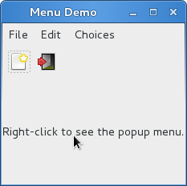

菜单
=====

GTK+有两种不同的菜单， :class:`Gtk.MenuBar` 和 :class:`Gtk.Toolbar` 。
:class:`Gtk.MenuBar` 是标准的菜单条，包含一个或多个 :class:`Gtk.MenuItem`
或其子类的实例。 :class:`Gtk.Toolbar` 控件用于可以快速地访问应用程序经常使用
的功能，其包含一个多个 :class:`Gtk.ToolItem` 或其子类的实例。

Actions
-------

尽管有相应的API来创建菜单和工具条，你应该使用 :class:`Gtk.UIManager` 并创建
:class:`Gtk.Action` 的实例。action被组织为组， :class:`Gtk.ActionGroup` 实质上就是
从名字到 :class:`Gtk.Action` 对象的映射。所有要用在某个特定上下文的action都应该
放在一个组中。多个action group可以用于特殊的用户界面，通常非一般的程序会使用多个组。
例如，在一个可以编辑多个文档的应用程序中，一组处理全局的action（如退出、关于、新建），
另一组每文档相关的则处理该文档的action（如保存、剪切/复制/粘贴）。没一个窗口的action
都应该由这两个action group组合而成。

不同的类代表了action不同的种类:

* :class:`Gtk.Action`: 一个可以通过菜单或工具条项目触发的action。
* :class:`Gtk.ToggleAction`: 一个可以通过在两种状态间切换触发的action。
* :class:`Gtk.RadioAction`: 在一组中只有一个可以激活的action。
* :class:`Gtk.RecentAction`: 代表一个最近使用文件的列表的action。

action代表用户可以执行的操作及其如何呈现的一些信息。这些信息包括name（不是用来显示），
label（用于显示），加速键，label是否引用 :ref:`stock item <stock-items>` ，提到信息及
action被激活时的回调函数。

要创建action，你可以直接调用构造函数，或者通过调用 :meth:`Gtk.ActionGroup.add_action` 或
:meth:`Gtk.ActionGrou.add_action_with_accel` 或以下便捷函数之一将action加入到action group中：

* :meth:`Gtk.ActionGroup.add_actions`,
* :meth:`Gtk.ActionGroup.add_toggle_actions`
* :meth:`Gtk.ActionGroup.add_radio_actions` 。

注意你必须指定菜单项和子菜单的action。

Action 对象
^^^^^^^^^^^^^^

.. class:: Gtk.Action(name, label, tooltip, stock_id)

    *name* 必须唯一。

    如果 *label* 不为 ``None`` ，将会在菜单项和按钮中显示。

    如果 *tooltip* 不为 ``None`` ，将会用于action的提示信息。

    如果 *stock_id* 不为 ``None`` ，将会用于查找 :ref:`stock item <stock-items>`
    代表action在控件中显示。

.. class:: Gtk.ToggleAction(name, label, tooltip, stock_id)

    参数与 :class:`Gtk.Action` 的构造函数相同。

.. class:: Gtk.RadioAction(name, label, tooltip, stock_id, value)

    前四个参数与 :class:`Gtk.Action` 的构造函数相同。

    *value* 代表当action被选中时 :meth:`get_current_value` 返回的值。

    .. method:: get_current_value()

        获取action所属组中当前激活的项目的 "value" 属性的值。

    .. method:: join_group(group_source)

        radio action对象加入 *group_source* radio action对象所属的组。

        *group_source* 必须我们要加入的组的一个 radio action 对象。
        或者传递 ``None`` 来将其移除组外。

.. class:: Gtk.ActionGroup(name)

    创建一个新的 :class:`Gtk.ActionGroup` 实例。action group 的名字用于与action关联健绑定。

    .. method:: add_action(action)

        添加一个 :class:`Gtk.Action` 对象到组中。

        注意本方法不会设置action的加速键，如需要请使用 :meth:`add_action_with_accel` 代替。

    .. method:: add_action_with_accel(action, accelerator)

        添加一个 :class:`Gtk.Action` 对象到action group中并设置加速键。

        *accelerator* 必须是 :func:`Gtk.accelerator_parse` 可以解析的格式，或者
        ``""`` 不设置加速键，或者 ``None`` 使用stock的加速键。

    .. method:: add_actions(entries[, user_data])

        这是一个便捷函数用来创建多个 :class:`Gtk.Action` 对象并将他们加入到action group中。

        *entries* 是一个包含一到六个以下元素的元组的列表：

        * action的name(必须的)
        * action 的 :ref:`stock item <stock-items>` (默认为 ``None``)
        * action 的lable (默认为 ``None``)
        * action 的加速键，格式为 :func:`Gtk.accelerator_parse` 可以识别的格式(默认为 ``None``)
        * action 的提示信息。 (默认为 ``None``)
        * action激活时调用的回调函数。(默认为 ``None``)

        aciton 的 "activate" 信号会与回调函数连接。

        如果 *user_data* 不为 ``None`` ，将会传递给毁掉函数（如果回调函数指定）。

    .. method:: add_toggle_actions(entries[, user_data])

        创建多个 :class:`Gtk.ToggleAction` 对象被添加到本组中的便捷函数。

        *entries* 是一个包含一到七个以下元素的元组的列表：

        * action的name(必须的)
        * action 的 :ref:`stock item <stock-items>` (默认为 ``None``)
        * action 的lable (默认为 ``None``)
        * action 的加速键，格式为 :func:`Gtk.accelerator_parse` 可以识别的格式(默认为 ``None``)
        * action 的提示信息。 (默认为 ``None``)
        * action激活时调用的回调函数。(默认为 ``None``)
        * 一个表示本toggle action是否激活的布尔值。(默认为 ``False``)

        aciton 的 "activate" 信号会与回调函数连接。

        如果 *user_data* 不为 ``None`` ，将会传递给毁掉函数（如果回调函数指定）。

    .. method:: add_radio_actions(entries[, value[, on_change[, user_data]]])

        创建多个 :class:`Gtk.RadioAction` 并添加到本组中的便捷函数。

        *entries* 是一个包含一到六个以下元素的元组的列表：

        * action的name(必须的)
        * action 的 :ref:`stock item <stock-items>` (默认为 ``None``)
        * action 的lable (默认为 ``None``)
        * action 的加速键，格式为 :func:`Gtk.accelerator_parse` 可以识别的格式(默认为 ``None``)
        * action 的提示信息。 (默认为 ``None``)
        * radio action 的值 (默认为 0)

        *value* 指定应该被激活的radio action。

        如何 *on_change* 指定，其会被连接到第一个radio action的 "changed" 信号。

        如果 *user_data* 不为 ``None`` ，将会传递给毁掉函数（如果回调函数指定）。

.. function:: Gtk.accelerator_parse(accelerator)

    解析代表加速键的字符串。格式类似于 "<Control>a" 或者 "<Shift><Alt>F1" 或者
    "<Release>z" (最后一个为按钮释放)。解析器是相当自由的，允许大小写及 "<Ctl>" and "<Ctrl>"
    这样的字符。对于character key，名字不是其符号，而是小写的英文，例如：
    应该使用 "<Ctrl>minus" 而不是 "<Ctrl>-" 。

    返回 ``(accelerator_key, accelerator_mods)`` 元组，其中后者代表
    accelerator modifier mask 地一个代表加速键的值。如果解析失败两者均返回0 。

UI Manager
----------

:class:`Gtk.UIManager` 提供了一种简单的方式以使用一种
`类似与XML的描述 <http://developer.gnome.org/gtk3/stable/GtkUIManager.html#XML-UI>`_
来创建菜单和工具条。

首先，你先要使用 :meth:`Gtk.UIManager.insert_action_group` 添加
:class:`Gtk.ActionGroup` 到 UI Manage。此时最好调用 :meth:`Gtk.UIManager.get_accel_group` 和
:meth:`Gtk.window.add_accel_group` 来通知父窗口响应指定的快捷键。

然后你就可以定义菜单和工具条的可见的布局信息并添加了。"ui string" 使用UML格式，
其中你应该指定你已经创建的action的name。记住这些名字只是标识符而已，他们并不是
用户在菜单和工具条中看到的文本。我们创建action时一般会使用能表达其意思的name。

最后，你通过 :meth:`Gtk.UIManager.get_widget` 获取root widget并将其添加到
:class:`Gtk.Box` 之类的容器中。

UIManager Objects
^^^^^^^^^^^^^^^^^

.. class:: Gtk.UIManager

    .. method:: insert_action_group(action_group[, pos])

        将action_group插入与mananger关联的action group组的列表中。之前组中的action会
        隐藏后面组中相同name的action。

        *pos* 为组插入的位置，如果忽略则会被追加到最后面。

    .. method:: get_accel_group()

        返回与此manage相关联的全局加速键。

    .. method:: get_widget(path)

        根据path查找控件，path包含UI的XML描述字符串中指定的name。
        XML中不包含name或者action属性的元素(例如 <popup>)可以通过XML的以 '/' 分隔的标记名
        (如 <popup>)来标识。根标记("/ui")可以被忽略。

        返回根据 *path* 找到的控件，如果没找到则返回 ``None`` 。

    .. method:: add_ui_from_string(text)

        解析 *text* 包含的 `UI 定义 <http://developer.gnome.org/gtk3/stable/GtkUIManager.html#XML-UI>`_
        并与当前manager的内容合并。如果没有闭合的<ui>元素，则会自动添加一个。

        返回合并后的UI的id。

        如果发生错误则抛出异常。

Example
-------

.. literalinclude:: examples/menu_example.py
    :linenos:
