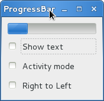

进度条
===========

:class:`Gtk.ProgressBar` 通常用来显示一个较长时间操作的进度信息，它给操作正在
进行中提供了一个视觉的效果。 :class:`Gtk.ProgressBar` 有两种模式： *percentage
mode* 和 *activity mode* 。

当程序知道需要执行的工作的工作量（例如从一个文件读取固定字节数）并且可以监视进度时，
可以使用 `Gtk.ProgressBar` 的 *percentage mode* ，这样用户可以看到一个正在前进的进度条
——指示任务完成的百分比，这种模式程序要周期性地调用 :meth:`Gtk.ProgressBar.set_fraction`
来更新进度条，传递一个介于0和1之间的值表示新的百分比。

当一个程序不知道任务的工作量时，可以使用 *activity mode* ，这种模式会显示一个
前后移动的进度块显示任务正在进行中。这种模式下，应用程序要周期性地调用
:meth:`Gtk.ProgressBar.pulse` 来更新进度条，你也可以通过
:meth:`Gtk.ProgressBar.set_pulse_step` 设置每次进度前进的数量。

默认情况下， :class:`Gtk.ProgressBar` 水平的从左向右显示进度，但你也可以通过调用
:meth:`Gtk.ProgressBar.set_orientation` 来改变进度条显示的方向是水平还是竖直。
进度条前进的方向则可以使用 :meth:`Gtk.ProgressBar.set_inverted` 来改变。
:class:`Gtk.ProgressBar` 也可以通过
:meth:`Gtk.ProgressBar.set_text` 和 :meth:`Gtk.ProgressBar.set_show_text`
来设置显示一些文本信息。

ProgressBar 对象
-------------------

.. class:: Gtk.ProgressBar()

    .. method:: set_fraction(fraction)

        使进度条 *填充* 给定百分比的进度。
        *fraction* 应该是在0.0和1.0之间，包含0和1。

    .. method:: set_pulse_step(fraction)

        设置每次调用 :meth:`pulse` 进度条滑块移动的进度占总进度的百分比。

    .. method:: pulse()

        一些进度完成了，但是程序不知道完成了多少时调用此函数使进度条进入
        *activity mode* ，这时会有一个进度滑块前后地移动。每次调用
        :meth:`pulse` 使滑块向前移动一点（每次pulse移动的数量由
        :meth:`set_pulse_step` 来设置）。

    .. method:: set_orientation(orientation)

        设置进度条显示的方向， *orientation* 可以是一下其中之一：

        * :attr:`Gtk.Orientation.HORIZONTAL`
        * :attr:`Gtk.Orientation.VERTICAL`

    .. method:: set_show_text(show_text)

        设置是否在进度条上叠加显示一些文本信息。显示的信息或者是 "text" 属性的值（
        :meth:`set_text` 设置），或者若其为 ``None`` ，会显示进度的百分比。

    .. method:: set_text(text)

        使给定的 *text* 叠加显示到进度条上。

    .. method:: set_inverted(inverted)

        进度条的方向一般是从左向右前进，inverted使进度条前进的方向翻转。

Example
-------

.. literalinclude:: examples/progressbar_example.py
    :linenos:
