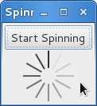

Spinner
=======

:class:`Gtk.Spinner` 显示一个图标大小的旋转动画。通常用来显示一个无尽的活动，代替进度条
:class:`GtkProgressBar` 。

要开始一个旋转动画，调用 :meth:`Gtk.Spinner.start`,
要停止旋转动画，调用 :meth:`Gtk.Spinner.stop` 。

Spinner 对象
----------------

.. class:: Gtk.Spinner()

    .. method:: start()

        开始旋转动画。

    .. method:: stop()

        停止旋转动画。

Example
-------
注：原例子使用的table布局，但前面翻译的时候分明又说table已经不建议使用了，
故自作主张将例子修改为了grid布局的版本了，见谅。

.. literalinclude:: examples/spinner_example.py
    :linenos:
