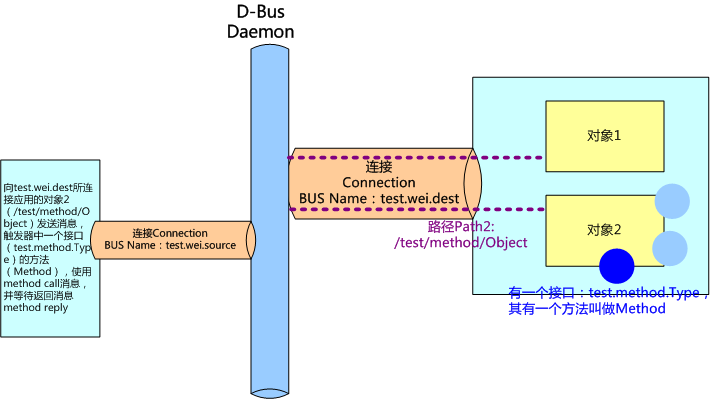
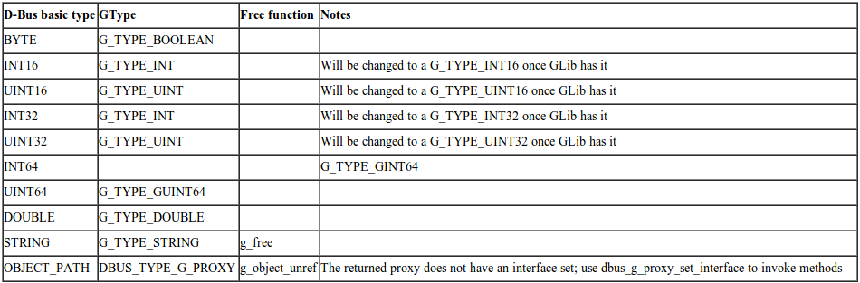
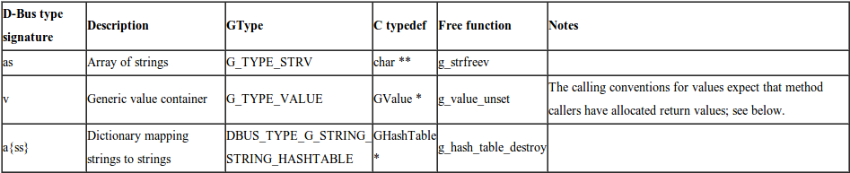

=======================
D-Bus 系列之入门
=======================

.. note::
    本文整理自 `D-Bus 学习系列文章 <http://blog.csdn.net/flowingflying/article/details/5410820>`_

背景知识
=============

有很多 IPC（interprocess communication ） ，用于不同的解决方案：CORBA 是用于面向对象编程中复杂的 IPC 的一个强大的解决方案。
DCOP 是一个较轻量级的 IPC 框架，功能较少，但是可以很好地集成到 K 桌面环境中。SOAP 和 XML-RPC 设计用于 Web 服务，因而使用 HTTP 作为其传输协议。
D-BUS 设计用于桌面应用程序和 OS 通信。D-Bus（其中 D 原先是代表桌面“Desktop” 的意思），即：用于桌面操作系统的通信总线。
现在逐渐被引入到嵌入式系统中，不过名字还是保留原先的叫法而已。

典型的桌面都会有多个应用程序在运行，而且，它们经常需要彼此进行通信。DCOP 是一个用于 KDE 的解决方案，但是它依赖于 Qt，所以不能用于其他桌面环境之中。
类似的，Bonobo 是一个用于 GNOME 的解决方案，但是非常笨重，因为它是基于 CORBA 的。它还依赖于 GObject，所以也不能用于 GNOME 之外。
D-BUS 的目标是将 DCOP 和 Bonobo 替换为简单的 IPC，并集成这两种桌面环境。
由于尽可能地减少了 D-BUS 所需的依赖，所以其他可能会使用 D-BUS 的应用程序不用担心引入过多依赖。
相对于其它的 IPC, D-Bus 丢掉了一些不必要的、复杂的东西，也正是因为这个原因，D-Bus 比较快、简单。
D-Bus 不和低层的 IPC 直接竞争，比如 sockets, shared memory or message queues. 这些低层点的 IPC 有它们自己的特点，和 D-Bus 并不冲突。

什么是 D-Bus
====================

D-Bus 是一个为应用程序间通信的消息总线系统，用于进程之间的通信。它是个 3 层架构的 IPC 系统，包括：

    a. 函数库 libdbus ，用于两个应用程序互相联系和交互消息。
    #. 一个基于 libdbus 构造的消息总线守护进程，可同时与多个应用程序相连，并能把来自一个应用程序的消息路由到 0 或者多个其他程序。
    #. 基于特定应用程序框架的封装库或捆绑（wrapper libraries or bindings ）。例如，libdbus-glib 和 libdbus-qt，还有绑定在其他语言，例如 Python 的。大多数开发者都是使用这些封装库的 API，因为它们简化了 D-Bus 编程细节。libdbus 被有意设计成为更高层次绑定的底层后端（low-level backend ）。大部分 libdbus 的 API 仅仅是为了用来实现绑定。

在 D-Bus 中，“bus”是核心的概念，它是一个通道：不同的程序可以通过这个通道做些操作，比如方法调用、发送信号和监听特定的信号。

D-Bus 是低延迟而且低开销的，设计得小而高效，以便最小化传送的往返时间。另外，协议是二进制的，而不是文本的，这样就排除了费时的序列化过程。
从开发者的角度来看，D-BUS 是易于使用的。有线协议容易理解，客户机程序库以直观的方式对其进行包装。D-Bus 的主要目的是提供如下的一些更高层的功能：

    a. 结构化的名字空间
    #. 独立于架构的数据格式
    #. 支持消息中的大部分通用数据元素
    #. 带有异常处理的通用远程调用接口
    #. 支持广播类型的通信

Bus daemon 是一个特殊的进程：这个进程可以从一个进程传递消息给另外一个进程。
当然了，如果有很多 applications 链接到这个通道上，这个 daemon 进程就会把消息转发给这些链接的所有程序。
在最底层，D-Bus 只支持点对点的通信，一般使用本地套接字（AF_UNIX）在应用和 bus daemon 之间通信。
D-Bus 的点对点是经过 bus daemon 抽象过的，由 bus daemon 来完成寻址和发送消息，因此每个应用不必要关心要把消息发给哪个进程。
D-Bus 发送消息通常包含如下步骤（正常情况下）：

    a. 创建和发送消息 给后台 bus daemon 进程，这个过程中会有两个上下文的切换
    #. 后台 bus daemon 进程会处理该消息，并转发给目标进程，这也会引起上下文的切换
    #. 目标程序接收到消息，然后根据消息的种类，做不同的响应：要么给个确认、要么应答、还有就是忽略它。最后一种情况对于“通知”类型的消息而言，前两种都会引起进一步的上 下文切换。

在一台机器上总线守护有多个实例 (instance)。这些总线之间都是相互独立的。

*一个持久的系统总线（system bus）*
    它在引导时就会启动。这个总线由操作系统和后台进程使用，安全性非常好，以使得任意的应用程序不能欺骗系统事件。
    它是桌面会话和操作系统的通信，这里操作系统一般而言包括内核和系统守护进程。
    这种通道的最常用的方面就是发送系统消息，比如：插入一个新的存储设备；有新的网络连接；等等。

*还将有很多会话总线（session buses）*
    这些总线当用户登录后启动，属于那个用户私有。它是用户的应用程序用来通信的一个会话总线。
    同一个桌面会话中两个桌面应用程序的通信，可使得桌面会话作为整体集成在一起以解决进程生命周期的相关问题。 这在 GNOME 和 KDE 桌面中大量使用。

综上原因，如果你准备在不同的进程之间传递大量的 数据，D-Bus 可能不是最有效的方法，最有效的方法是使用共享内存，但是对共享内存的管理也是相当复杂的。

D-Bus 编程经常涉及的一些概念
===================================================

*地址*
    连接建立有 server 和 client，对于 bus daemon，应用就是 client，daemon 是 server。
    一个 D-Bus 的地址是指 server 用于监听，client 用于连接的地方，例如 unix:path=/tmp/abcedf 标识 server 将在路径 /tmp/abcedf 的 UNIX domain socket 监听。
    地址可以是指定的 TCP/IP socket 或者其他在或者将在 D-Bus 协议中定义的传输方式。
    如果使用 bus daemon，libdbus 将通过读取环境变量自动获取 session bus damon 的地址，通过检查一个指定的 UNIX domain socket 路径获取 system bus 的地址。如果使用 D-bus，但不是 daemon，需要定义那个应用是 server，那个是 client，并定义一套机制是他们认可 server 的地址，这不是通常的做法。

*Bus Names 总线名字*
    当一个应用连接到 bus daemon，daemon 立即会分配一个名字给这个连接，称为 unique connection name，
    这个唯一标识的名字以冒号：开头，例如：34-907，这个名字在 daemon 的整个生命周期是唯一的。
    但是这种名字总是临时分配，无法确定的，也难以记忆，因此应用可以要求有另外一个名字 well-known name 来对应这个唯一标识，就像我们使用域名来对应 IP 地址一样。
    例如可以使用 com.mycompany 来映射：34-907。应用程序可能会要求拥有额外的周知名字（well-known name）。
    例如，你可以写一个规范来定义一个名字叫做 com.mycompany.TextEditor。
    应用程序就可以发送消息到这个总线名字，对象，和接口以执行方法调用。
    当一个应用结束或者崩溃是，OS kernel 会关闭它的总线连接。总线发送 notification 消息告诉其他应用，这个应用的名字已经失去他的 owner。
    当检测到这类 notification 时，应用可以知道其他应用的生命周期。这种方式也可用于只有一个实例的应用，即不开启同样的两个应用的情况。

*原生对象和对象路径*
    所有使用 D-BUS 的应用程序都包含一些对象，当经由一个 D-BUS 连接受到一条消息时，该消息是被发往一个对象而不是整个应用程序。
    在开发中程序框架定义着这样的对象，例如 JAVA，GObject，QObject 等等，在 D-Bus 中成为 native object。
    对于底层的 D-Bus 协议，即 libdbus API，并不理会这些 native object，它们使用的是一个叫做 object path 的概念。
    通过 object path，高层编程可以为对象实例进行命名，并允许远程应用引用它们。
    这些名字看起来像是文件系统路径，易读的路径名是受鼓励的做法，但也允许使用诸如“/com/mycompany/c5yo817y0c1y1c5b”等，只要它可以为你的应用程序所用。
    Namespacing 的对象路径以开发者所有的域名开始（如 /org/kde）以避免系统不同代码模块互相干扰。
    简单地说：一个应用创建对象实例进行 D-Bus 的通信，这些对象实例都有一个名字，命名方式类似于路径，
    例如 /com/mycompany，这个名字在全局（session 或者 system）是唯一的，用于消息的路由。

*Proxies 代理*
    代理对象用来表示其他远程的 remote object。
    当我们触发了 proxy 对象的 method 时，将会在 D-Bus 上发送一个 method_call 的消息，并等待答复，根据答复返回。使用非常方便，就像调用一个本地的对象。

*接口 Interface*
    每一个对象支持一个或者多个接口，接口是一组方法和信号，接口定义一个对象实体的类型。
    D-Bus 对接口的命名方式，类似 org.freedesktop.Introspectable。开发人员通常将使用编程语言类的的名字作为接口名字。

*方法和信号 Methods and Signals*
    每一个对象有两类成员：方法和信号。方法就是 JAVA 中同样概念，方法是一段函数代码，带有输入和输出。信号是广播给所有兴趣的其他实体，信号可以带有数据 payload。
    在 D-BUS 中有四种类型的消息：方法调用（method calls）、方法返回（method returns）、信号（signals）和错误（errors）。
    要执行 D-BUS 对象的方法，您需要向对象发送一个方法调用消息。
    它将完成一些处理（就是执行了对象中的 Method，Method 是可以带有输入参数的。）并返回，返回消息或者错误消息。
    信号的不同之处在于它们不返回任何内容：既没有“信号返回”消息，也没有任何类型的错误消息。

通过上面的描述，我们可以获得下面的视图：:

    Address –> [Bus Name] –> Path –> Interface –> Method

bus name 不是必要的，它只在 daemon 的情况下用于路由，点对点的直接连接是不需要的。
简单地说 ：Address 是 D-Bus 中 server 用来监听 client 的地址，当一个 client 连接上 D-Bus，通常是 Daemo 的方式，这个 client 就有了一个 Bus Name。
其他应用可以根据消息中所带的 Bus Name，来判断和哪个应用相关。
消息在总线中传递的时候，传递到应用中，再根据 object path，送至应用中具体的对象实例中，也就是是应用中根据 Interface 创建的对象。
这些 Interface 有 method 和 singal 两种，用来发送、接收、响应消息。

这些概念对初学者可能会有些混淆，但是通过后面学习一个小程序，就很清楚，这是后面一个例子的示意图，回过头来看看之前写的这篇文章，这个示意图或许会更清楚。

D-Bus 消息类型
=====================

消息通过 D-Bus 在进程间传递。有四类消息：
a. Method call 消息：将触发对象的一个 method
#. Method return 消息：触发的方法返回的结果
#. Error 消息：触发的方法返回一个异常
#. Signal 消息：通知，可以看作为事件消息。

一个消息有消息头 header，里面有 field，有一个消息体 body，里面有参数 arguments。消息头包含消息体的路由信息，消息体就是净荷 payload。头字段可能包括发送者的 bus 名，目的地的 bus 名，方法或者 signal 名等等，其中一个头字段是用于描述 body 中的参数的类型，例如“i”标识 32 位整数，"ii”表示净荷为 2 个 32 为整数。

发送 Method call 消息的场景
----------------------------------

一个 method call 消息从进程 A 到进程 B，B 将应答一个 method return 消息或者 error 消息。
在每个 call 消息带有一个序列号，应答消息也包含同样的号码，使之可以对应起来。
他们的处理过程如下：

    a. 如果提供 proxy，通过触发本地一个对象的方法从而触发另一个进程的远端对象的方法。应用调用 proxy 的一个方法，proxy 构造一个 method call 消息发送到远端进程。
    #. 对于底层的 API，不使用 proxy，应用需要自己构造 method call 消息。
    #. 一个 method call 消息包含：远端进程的 bus name，方法名字，方法的参数，远端进程中 object path，可选的接口名字。
    #. method call 消息发送到 bus daemon
    #. bus daemon 查看目的地的 bus name。如果一个进程对应这个名字，bus daemon 将 method call 消息发送到该进程中。如果没有发现匹配，bus daemon 创建一个 error 消息作为应答返回。
    #. 进程接收后将 method call 消息分拆。对于简单的底层 API 情况，将立即执行方法，并发送一个 method reply 消息给 bus daemon。对于高层的 API，将检查对象 path，interface 和 method，触发一个 native object 的方法，并将返回值封装在一个 method reply 消息中。
    #. bus daemon 收到 method reply 消息，将其转发到原来的进程中
    #. 进程查看 method reply 消息，获取返回值。这个响应也可以标识一个 error 的残生。当使用高级的捆绑，method reply 消息将转换为 proxy 方法的返回值或者一个 exception。

Bus daemon 保证 message 的顺序，不会乱序。例如我们发送两个 method call 消息到同一个接受方，他们将按顺序接受。接收方并不要求一定按顺序回复。消息有一个序列号了匹配收发消息。

发送 Signal 的场景
---------------------------

signal 是个广播的消息，不需要响应，接收方向 daemon 注册匹配的条件，包括发送方和信号名，bus 守护只将信号发送给希望接受的进程。

处理流程如下：

    a. 一个 signal 消息发送到 bus daemon。
    #. signal 消息包含发布该信号的 interface 名字，signal 的名字，进程的 bus 名字，以及参数。
    #. 任何进程都可以注册的匹配条件（match rules) 表明它所感兴趣的 signal。总线有个注册 match rules 列表。
    #. bus daemon 检查那些进程对该信号有兴趣，将信号消息发送到这些进程中。
    #. 收到信号的进程决定如何处理。如果使用高层的捆绑，一个 porxy 对象将会释放一个 native 的信号。如果使用底层的 API，进程需要检查信号的发送方和信号的名字决定如何进行处理。

Introspection
　　D-Bus 对象可能支持一个接口 org.freedesktop.DBus.Introspectable。该接口有一个方法 Introspect，不带参数，将返回一个 XML string。这个 XML 字符串描述接口，方法，信号。

简单的例子
===============

D-Bus 类型和 GType 的映射
-----------------------------------

在 D-Bus 编程中，基础类型和 GType 的映射表格如下。在后面的程序小例子中我们会看到具体如何对应。

在 D-Bus 编程中，container 类型和 GType 的映射表格如下：

在下面的例子中，使用了 dbus-1 dbus-glib-1 glib-2.0。Makefile 的如下：

.. literalinclude:: _source/dbus/Makefile
    :language: make
    :linenos:

同步的例子
------------------------

同步即程序发出 method call 消息，等待 method_return 消息。下面是一个小例子，如果我们用 dbus-send 命令，可以使用：

.. code-block:: bash

    dbus-send --session --print-reply --type=method_call --dest=org.freedesktop.Notifications / org.freedesktop.DBus.Introspectable.Introspect

.. literalinclude:: _source/dbus/sync_sample.c
    :language: c
    :linenos:

异步的例子
---------------------------
异步中，程序将不等返回消息，继续执行，等有返回消息的时候，触发一个回调函数 。下面是同样的操作，但是用异步的方式来实现：

.. literalinclude:: _source/dbus/async_sample.c
    :language: c
    :linenos:

Signal 的收发的例子
====================
现在从底层，即 libdbus 学习如何发送 signal，以及如何监听 signal。signal 在 D-Bus 的 Daemon 中广播，为了提高效率，只发送给向 daemon 注册要求该 singal 的对象。
程序，第一步需要将应用和 D-Bus 后台建立连接，也就是和 System D-Bus daemon 或者 Session D-Bus daemon 建立连接。
一旦建立，daemon 会给这条连接分配一个名字，这个名字在 system 或者 session 的生命周期是唯一的，
即 unique connection name，为了方便记忆，可以为这条连接分配一个便于记忆的 well-known name。
对于信号方式，分配这个名字不是必须的（在 method_call 中是需要的，我们在下一次学习中谈到），因为在信号的监听中秩序给出 Interface 的名字和信号名称。
在下面的例子中，可以将相关的代码屏蔽掉，不影响运行，但是通常我们都这样处理，尤其在复杂的程序中。

在我们的例子中，定义这个 BUS name 为 test.singal.source。当然一个好的名字，为了避免于其他应用重复，应当使用 com.mycompany.myfunction 之类的名字。
而 interface 的名字，一般前面和 connection 的 BUS name 一致。

发送方的程序
----------------------------------

.. literalinclude:: _source/dbus/signal_send.c
    :language: c
    :linenos:

接收该信号的的例子
--------------------------------

.. literalinclude:: _source/dbus/signal_recv.c
    :language: c
    :linenos:

Method 的收发小例子
===========================
现在我们从底层，即 libdbus 学习如何发送 Method 以及如何等待应答，在之前的代码中，我们给出了同步方式的代码 ，这是更为高层的处理方式，建议使用。
监听 method 和监听 signal 的方式非常相似。在给出例子之前，我希望和上次学习一样给出一个示意图，更好地了解 D-Bus 的各个概念。

.. image:: images/method_example.png

在下面的例子中，我们将学习如何在消息中加入多个参数的情况。

方法监听的例子
------------------------
Method 的监听和 signal 的监听的处理时一样，但是信号是不需要答复，而 Method 需要。

.. literalinclude:: _source/dbus/method_service.c
    :language: c
    :linenos:

方法调用的例子
--------------------
.. literalinclude:: _source/dbus/method_call.c
    :language: c
    :linenos:

使用 xml 定义 D-Bus 接口
==========================
在 D-Bus 中，可以将 D-Bus 接口定义用 XML 格式表述处理，并利用工具，自动生成头文件，给出工整的调用方式。

下面是一个 XML 的例子。

客户端
----------
.. literalinclude:: _source/dbus/dbus-client.xml
    :language: c
    :linenos:

.. code-block:: bash

    dbus-binding-tool --mode=glib-client --prefix=com_wei wei.xml > wei_client.h

服务端
----------
.. literalinclude:: _source/dbus/dbus-server.xml
    :language: c
    :linenos:

.. code-block:: bash

    dbus-binding-tool --mode=glib-server --prefix=com_wei wei.xml > wei_server.h

其他参考资料
===============

.. only:: builder_html

   缓存版：

   1. :download:`Nokia D-Bus page <docs/qtdbus.pdf>`
   #. :download:`KDE Base D-Bus example <docs/qt-dbus-example.pdf>`
   #. :download:`telepathy D-Bus page <docs/qt-dbus-telepathy.pdf>`

原始链接

1. `Nokia D-Bus page <http://developer.nokia.com/community/wiki/QtDbus_quick_tutorial>`_
#. `KDE Base D-Bus example <http://techbase.kde.org/Development/Tutorials/D-Bus/CustomTypes?setlang=zh-cn#Generate_Adaptor_and_Interface_classes>`_
#. `telepathy D-Bus page <http://telepathy.freedesktop.org/doc/book/sect.basics.dbus.html>`_

