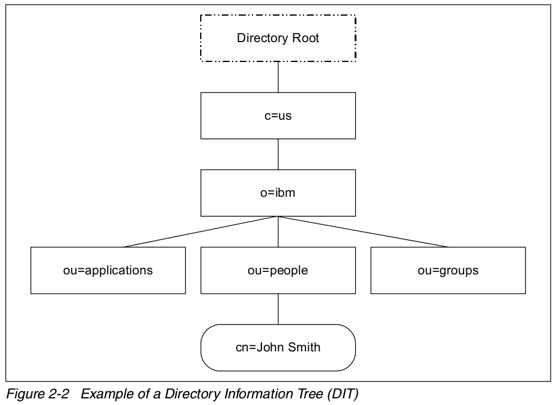

=======
LDAP
=======

LDAP 定义
==========
本文不打算重复 LDAP 的标准定义，仅谈一下自己的理解。

LDAP 译为轻量级目录访问协议，一般网上经常拿其与关系型数据库做类比并比较他们的不同。

事实上，LDAP 既不是数据库也不是存储数据的方法，而是用来访问数据的方法。LDAP 可以访问的
是存储在目录信息树（Directory Information Tree (DIT)）中的数据。

目录信息树存储数据的方法与关系型数据库非常的不同。关系型数据库的数据是存储在某一数据库
的某一数据表中的某以记录内的，因此数据库中定位一条记录数据需要三个要素：数据库、
数据表、记录号；目录信息树存储数据的方式是树状结构，定位一条数据的方法是从树根到叶子节点
的唯一路径，数据就存储在叶子节点中。

由此可见，LDAP 与关系型数据库类比其实是两种数据存储与访问方式的类比。

LDAP 是访问目录信息树中数据的协议
------------------------------------
事实上，LDAP 仅定义了访问协议，数据的真实存储方式并不在 LDAP 的考量范围内，即只要提供了
目录访问接口的数据都可以通过 LDAP 协议来访问，如果关系型数据库实现了该接口也是可以通过
LDAP 协议来反问的。从这个角度来讲，确实不应该将 LDAP 与关系型数据库做类比。

LDAP 特性
=============
且 LDAP 对数据的读取和查询做了优化，并不适用于经常变动的数据。

LDAP 不定义客户端和服务端的工作方式，但会定义客户端和服务端的通信方式，
另外，LDAP 还会定义 LDAP 数据库的访问权限及服务端数据的格式和属性。

LDAP 有三种基本的通信机制：没有处理的匿名访问；基本的用户名、密码形式的认证；使用 SASL、SSL 的安全认证方式。LDAP 和很多其他协议一样，基于 tcp/ip 协议通信，注重服务的可用性、信息的保密性等等。部署了 LDAP 的应用不会直接访问目录中的内容，一般通过函数调用或者 API，应用可以通过定义的 C、Java 的 API 进行访问，Java 应用的访问方式为 JNDI(Java Naming and Directory Interface)。

LDAP 结构
============
目录信息树
---------------
目录信息树以目录条目（entry）来存储和组织数据，每一个目录条目通常描述一个对象（例如：一个人），
目录条目有一个唯一名（DN，distinguished name）进行标识。DN 由一系列的相对唯一名（RDN，relative distinguished name）来标识。每一个目录条目由一或多个属性来描述该条目，例如描述人的条目有一个
电话号码的属性。

引用一张 `Understanding LDAP
Design and Implementation <http://www.redbooks.ibm.com/abstracts/sg244986.html>`_ 的图示，

目录条目根据他们在目录信息树中的位置命名，上图底部的目录条目的 DN 唯一名是：:

    cn=John Smith,ou=people,o=ibm,c=us.
    The organizational group people has the DN of ou=people,o=ibm,c=us.

LDAP 的查询等操作语句在这里就不介绍了，有需求的可以在参考资料中找。

LDAP 安全
============
LDAP 安全相关的资料请参考 `LDAP 注入与防御剖析 <http://drops.wooyun.org/tips/967>`_

LDAP 服务器配置
=================

请参考 `OpenLDAP 管理员指南 <http://wiki.jabbercn.org/index.php?title=XEP-0216&oldid=115>`_

参考资料
===========
* `LDAP 注入与防御剖析 <http://drops.wooyun.org/tips/967>`_
* `Understanding LDAP Design and Implementation <http://www.redbooks.ibm.com/abstracts/sg244986.html>`_
* `OpenLDAP 管理员指南 <http://wiki.jabbercn.org/index.php?title=XEP-0216&oldid=115>`_
